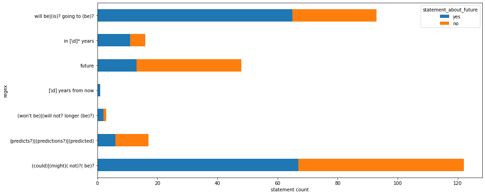

# bdlt_project_the_prophets
This is the code repository for a project within the [**Big Data and Language Technologies**](https://temir.org/teaching/big-data-and-language-technologies-ss22/big-data-and-language-technologies-ss22.html) module at the university of Leipzig.  
The project is about *statements about the future* regarding climate change in Twitter data (tweets).  
For this small project [**The climate change Twitter dataset**](https://doi.org/10.1016/j.eswa.2022.117541), available at [Kaggle](https://www.kaggle.com/datasets/deffro/the-climate-change-twitter-dataset), was used and further processed.

## data processing steps
### splitting the data
The dataset has over 15 million data entries in **.csv** format, which is too much to handle for most standard hardware. Thus it was split into smaller chunks containing only 1 million entries each with the `1_split_large_csv.py` script.

### scraping tweet text
For finding *statements about the future* the tweets text is crucial, but not contained in the original dataset. As Twitter has [API restrictions](https://developer.twitter.com/en/docs/twitter-api/rate-limits) (900 tweets every 15 minutes), only every eights tweet was scraped with the `2_get_tweets_for_ids.py` script. For this to work at least one Twitter account with API access is required. As the data is split into chunks, the script can be run for each chunk in parallel, if that many API access Twitter accounts exist.

### finding *statements about the future*
The scraped tweets were searched for *statements about the future* with the help of [regular expressions](https://en.wikipedia.org/wiki/Regular_expression) in the script `3_get_future_statements.py`. Not all expressions performed equally well:

### data cleaning
Twitter data is often contains hyperlinks, user references, emojis and whitespaces. These were cleaned with the script `4_data_cleaning.py`.

### data deduplication
Since automation on Twitter is allowed, spamming occurs on the online social network. Thus these duplicates had to be found and removed from the dataset with the script `5_deduplicate_data.py`. For this the data was grouped per day and on each day only the originals (first occurence of a tweet) were kept.

### sentiment classification
For more information on the *statements about the future*, the tweet texts were sentiment scored with the [TextBlob](https://textblob.readthedocs.io/en/dev/) library and the [latest Twitter roBERTa](https://huggingface.co/cardiffnlp/twitter-roberta-base-sentiment-latest) model available at HuggingFace. The new metrics were appened to the deduplicated data in the `6_add_metrics.py` script.

## data measurement
### counting the data
As each processing step included a reduction of data, the `count_data_entries.py` script counts the entries of each step.

### data statistics
Basic statistics like the distribution of categorical values on each processing step were measured in the `dataset_statistics.py` script.

### *statement about the future* quality
The quality of the extracted statements were measured by manually labeling a small data sample of 300 entries. They were extracted with the `extract_random_datasample_to_label.py` script. The labeled sample can be found in `data/random_statement_sample_manually_classified.csv`.

### visualization
Visializations of the data can be found in the `visualization.ipynb` notebook and the `plots/` folder.